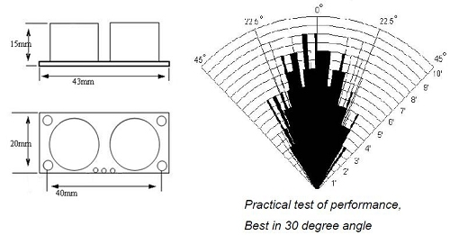
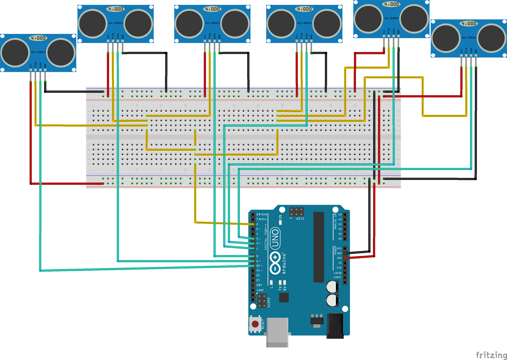

= HCSR04 ultrasonic sensor Library for Arduino =
==========
HCSR04 is an [Arduino](http://arduino.cc) library HCSR04 Sensors



Documentation
-------------
Documentation for the library is on the
[Github Project Pages](https://github.com/gamegine/HCSR04-ultrasonic-sensor-lib)

[basic example](examples/HCSR04/HCSR04.ino)


```ino
#include <HCSR04.h>

HCSR04 hc(2,3);//initialisation class HCSR04 (trig pin , echo pin)

void setup()
{ Serial.begin(9600); }

void loop() 
{ Serial.println( hc.dist() ); } //return current distance (cm) in serial
```
> if you want use a multiple sensor   

```ino
#include <HCSR04.h>

HCSR04 hc(2,new int[6]{5,6,7,8,9,10},6);//initialisation class HCSR04 (trig pin , echo pins, number of sensors)

void setup()
{ Serial.begin(9600); }

void loop()
{ for (int i = 0; i < 6; i++ ) {Serial.println( hc.dist(i) );} }//return curent distance (cm) in serial for sensor 1 to 6
```

Download
--------
The last version of the Library is available on the github
[HCSR04 Page](https://github.com/gamegine/HCSR04-ultrasonic-sensor-lib/releases) 


Install
-------
The library can be installed using the [standard Arduino library install procedure](http://arduino.cc/en/Guide/Libraries)  

[License](https://github.com/gamegine/HCSR04-ultrasonic-sensor-lib/blob/master/LICENSE)
-------
[MIT License](https://github.com/gamegine/HCSR04-ultrasonic-sensor-lib/blob/master/LICENSE)
